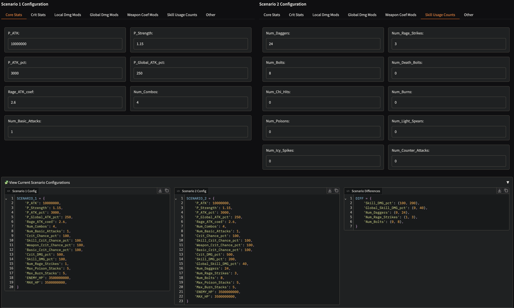
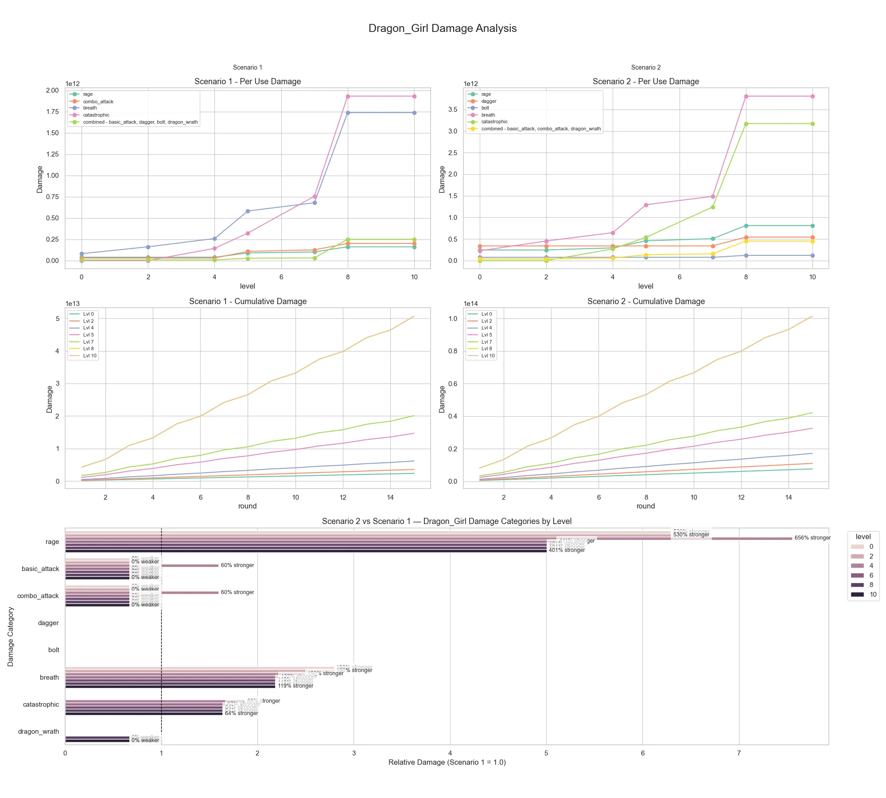
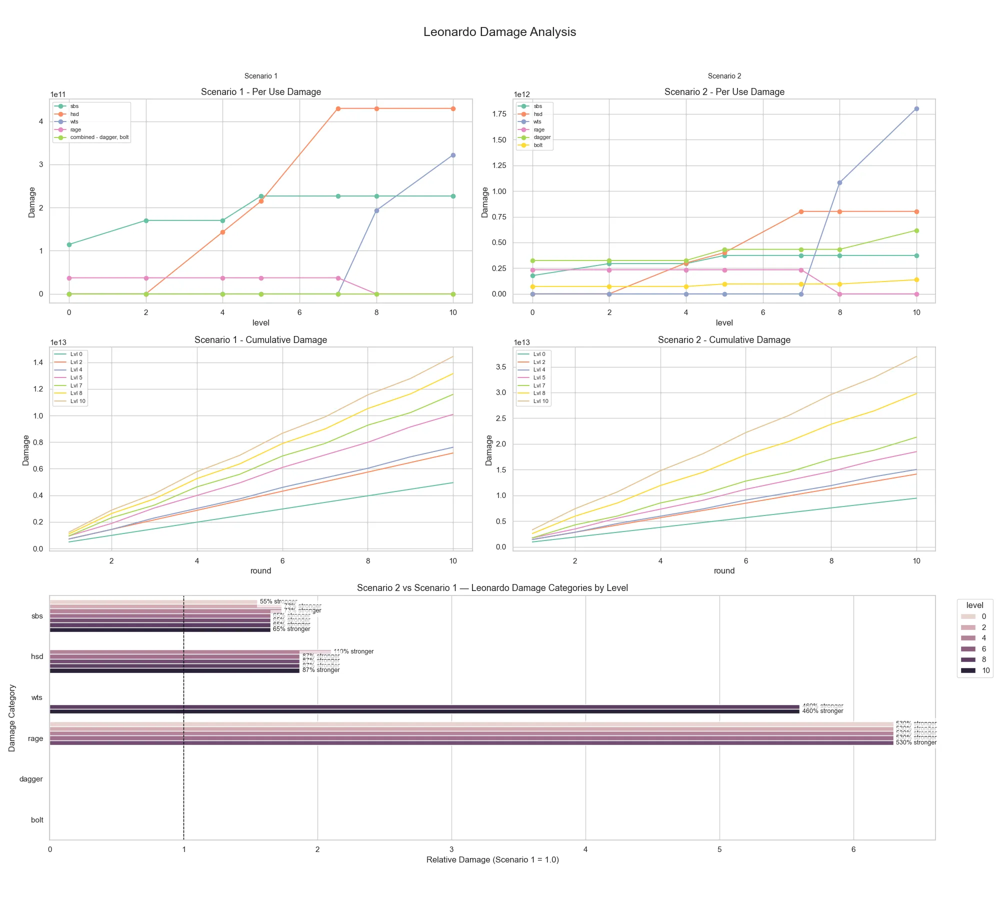
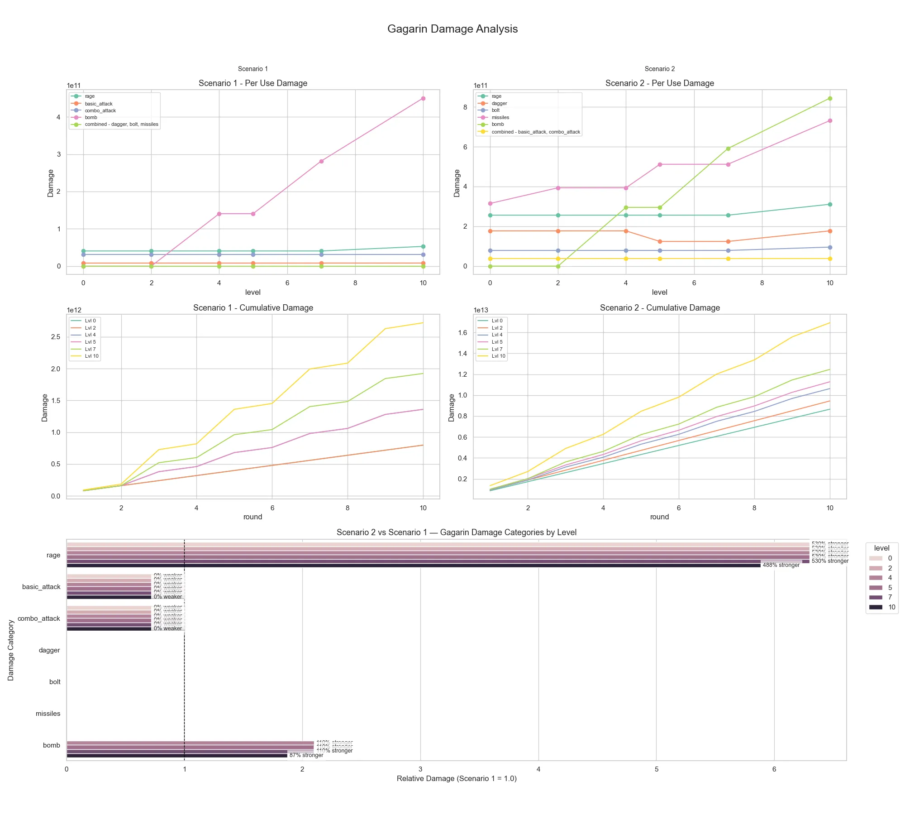
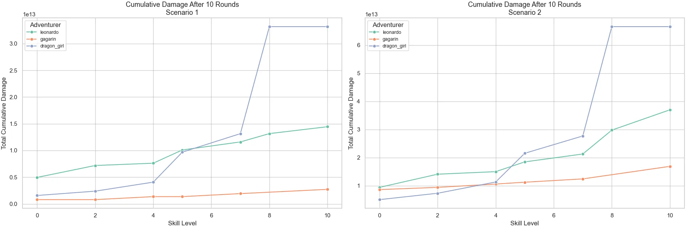
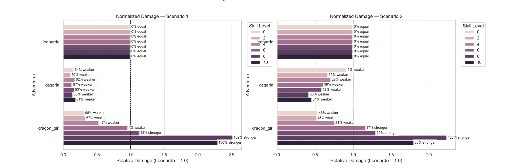

# 🧮 Capybara Go Damage Formula Simulator

This is an interactive simulator for calculating and comparing skill-based damage in a Go-themed. It helps players optimize their builds by allowing detailed stat input, skill usage modeling, and scenario comparison.

The simulator uses Gradio to provide a clean and interactive web interface where users can:

- Input stat configurations for two different scenarios
- Compare total and normalized damage outputs
- View breakdowns of how each skill contributes to overall damage
- Validate calculations with a summary of active input parameters
- Explore detailed per-skill multipliers and coefficients

---

## 🚀 Features

- Compare up to two different builds (e.g., different skill counts or multipliers)
- Visualize damage over 10 rounds for each character
- Review raw configuration and see which inputs differ
- Interactive tables and plots
- No installation required beyond Python and pip

---

## 🛠 Installation

```bash
git clone https://github.com/dextroxic/capybara_go_damage_formula.git
cd capybara_go_damage_formula
make install
````

This will:

* Create a virtual environment in the `venv/` folder
* Install all required Python packages from `requirements.txt`

---

## ▶️ Usage

Start the simulator:

```bash
make run
```

This will launch the Gradio interface in your browser.

---

## 🧾 How to Use

1. **Input Stats**
   Use your in-game stat screen as a reference. Enter values such as `P_ATK`, `Skill_DMG_pct`, `Dagger_DMG_pct`, etc.

   ⚠️ *Note: Some values shown in-game do not reflect temporary battle effects (tree inheritance, brands, artifact bonuses, skills, etc.). Add those manually as needed.*

2. **Configure Skill Usage**
   You can enter:

   * `Num_Daggers`: Number of daggers thrown per battle
   * `Num_Rage_Strikes`: Rage skill activations
   * `Num_Bolts`, etc.

3. **Click "Run Damage Analysis"**
   View multiple visualizations and breakdowns showing:

   * Total damage
   * Normalized damage
   * Skill-by-skill breakdowns
   * Input configuration summaries
   * Differences between the two selected scenarios

---

## 📊 Output Examples

Below are example outputs from the simulator after running a sample configuration for Gagarin, Leonardo, and Dragon Girl.

---

### 🧠 Configuration Panel



This is the user input area where you configure the stats for two different scenarios. You can input values like `P_ATK`, `Skill_DMG_pct`, `Num_Daggers`, and more for each scenario. These fields map directly to your in-game stats, but you're expected to adjust them manually for effects not visible in your character sheet (e.g., inheritance, brands, temporary buffs).

---

### 🐲 Dragon Girl – Damage Breakdown



This plot shows Dragon Girl’s damage output over 10 rounds across different skill levels. The line for each scenario indicates cumulative damage. This helps identify which skill levels offer the best returns for your build.

---

### 🧠 Leonardo – Damage Breakdown



Similar to Dragon Girl’s plot, this figure tracks Leonardo’s total damage. You can compare performance improvements as skill levels or stack counts are increased.

---

### ⚔️ Gagarin – Damage Breakdown



Shows how Gagarin performs across skill levels and under different configurations. Use this to evaluate how boosts like `Global_Dagger_DMG_pct` and `Num_Daggers` affect total damage.

---

### 📈 Cumulative Damage Comparison (Final Round)



This summary chart displays cumulative damage for all characters at the **10th round**, grouped by skill level and scenario. It's great for high-level comparisons between builds.

---

### 📉 Normalized Damage Difference



This visualization normalizes damage so you can clearly see which configuration performs better **per character** across different skill levels. The closer the values, the more similar the builds are; large gaps indicate better optimization opportunities.

---
